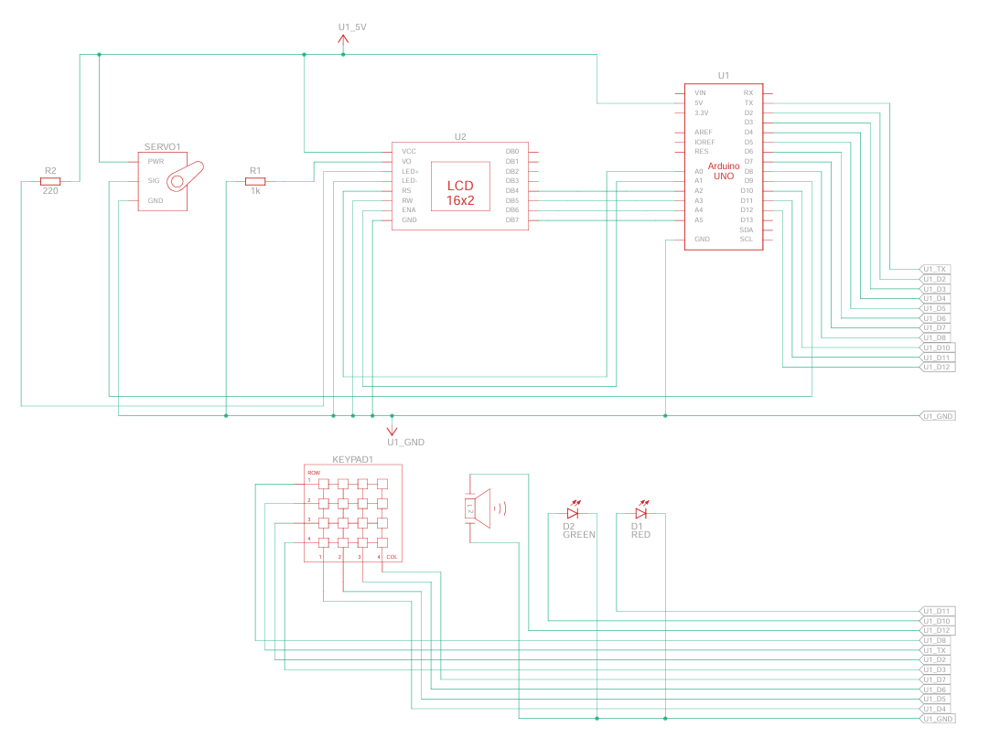
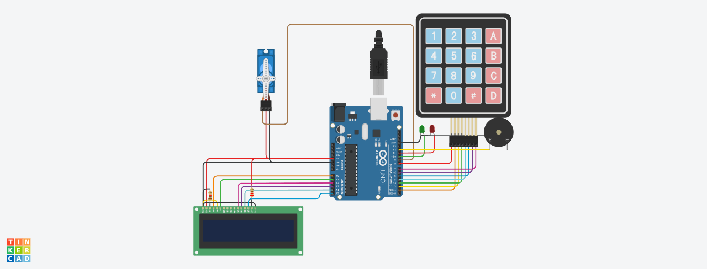
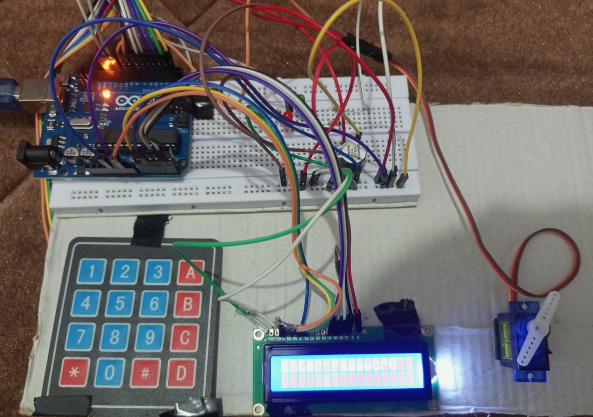
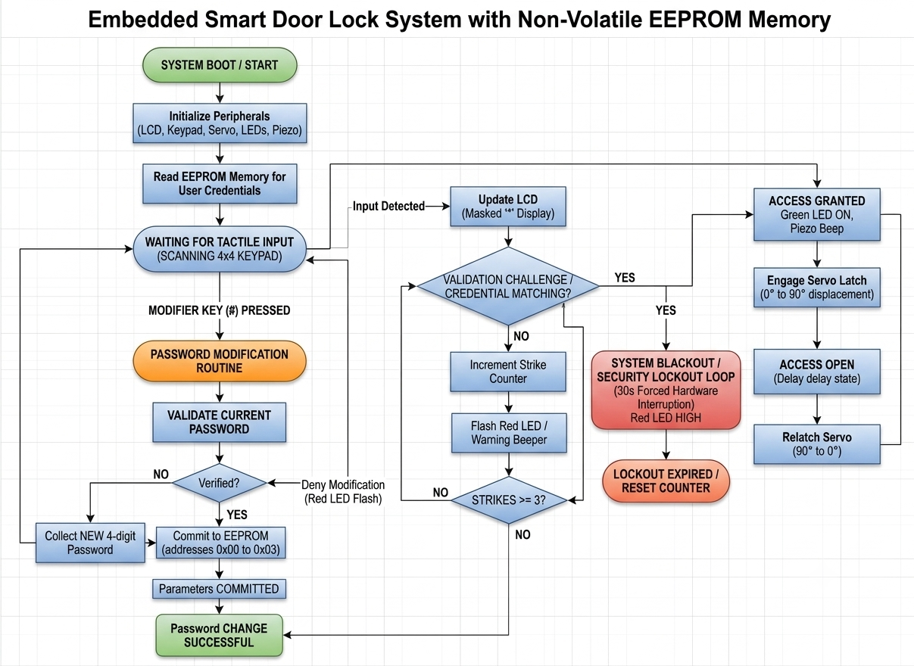

<div align="center">

# 🔐 Embedded Smart Door Lock System with Non-Volatile EEPROM Memory

### 4x4 Matrix Keypad Scan • 16x2 LCD UI Panel • Micro Servo Actuator • EEPROM Flash Backup


<br>

*A high-level embedded security application utilizing an Arduino microcontroller to drive an automated physical barrier lock. The system integrates a dynamic user credential database with direct flash memory persistence and anti-brute-force defense protocols.*

</div>

---
<!-- Banner -->
<p align="center">
  
</p>

# 📖 Project Overview

Access control systems are fundamental pillars of modern physical security infrastructure. Transitioning mechanical latching assemblies into automated, digital security systems requires reliable electronic human-machine interfaces (HMIs) and fail-safe data storage.

This project introduces the **design, schematic validation, and programmatic architecture of a Smart Door Lock System**. The system consists of three foundational structural layers:

- **Multiplexed Input & Visual Output Interfaces (4x4 Matrix Keypad & 16x2 LCD)**
- **Non-Volatile Static State Storage (Internal Microcontroller EEPROM)**
- **Mechanical Servo Latching & Active Audio-Visual Alert Arrays**

During standard operation, the controller scans human tactile input through a multiplexed 4x4 keypad matrix and echoes masked security metrics on a 16x2 alphanumeric display. If the matching algorithm validates the structural data array against the pre-loaded primary security array, a pulse-width modulation (PWM) servo motor disengages the mechanical door bolt mechanism. 

To ensure long-term stability and residential reliability, custom user configurations are committed directly to non-volatile EEPROM memory cells, preserving custom passcodes across power blackouts without relying on auxiliary backup batteries.

---

# 🎯 Project Objectives

The primary engineering benchmarks established for this architecture include:

- Design a standalone, human-interactive digital security enclosure.
- Process matrix keypad arrays to implement real-time debounce filtering.
- Drive parallel 4-bit alphanumeric visual data updates onto an LCD panel.
- Implement an automated fallback procedure to load passwords from flash storage upon cold boots.
- Build an on-the-fly secondary credential management system protected by active validation challenges.
- Engineer an anti-brute-force mechanism enforcing a 30-second hardware blackout loop on a 3-strike failure limit.
- Reconstruct the physical input terminal trace assignments to safely isolate row-scanning operations from hardware serial transceivers (`TX/RX`).

---

# 📦 Component Bill of Materials (BOM)

| Designator | Quantity | Component | Description / Role |
| :--- | :---: | :--- | :--- |
| **U1** | 1 | Arduino Uno R3 | Central microcontroller system processing logic units |
| **U2** | 1 | LCD 16 x 2 | Alphanumeric UI system display module |
| **R1** | 1 | 1 kΩ Resistor | Pull-down configuration resistor |
| **R2** | 1 | 220 Ω Resistor | Inline current limiter for signaling nodes |
| **KEYPAD1** | 1 | Keypad 4x4 | Matrix input tactile user scanning array |
| **SERVO01** | 1 | Positional Micro Servo | Mechanical lock actuator assembly |
| **D1** | 1 | Red LED | Visual notification light for access denial or lockouts |
| **D2** | 1 | Green LED | Visual notification light for authorized entry access |
| **PIEZO01** | 1 | Piezo | Audio feedback active buzzer chime sound generator |

---

# 🗺️ System Visuals & Schematics

### 1. Schematics (Tinkercad)
Detailed architectural schematic layout showcasing internal electrical paths, signal dividers, and logic pathways.



### 2. Circuit Diagram (Tinkercad Simulation)
Virtual breadboard layout demonstrating initial component spacing and interactive trace routing.



### 3. Physical Hardware Construction
The deployed physical circuit assembly demonstrating exact terminal wiring and final hardware placement.



# 🔄 System Flowchart

<p align="center">
  
</p>

---
# 🎥 Project Demonstration

> **Watch the project in action**

[Watch Video](WhatsApp Video 2026-07-17 at 10.49.23 AM.mp4)


---

# 💻 Production Source Code

```cpp
#include <Keypad.h>
#include <LiquidCrystal.h>
#include <Servo.h>
#include <EEPROM.h>

// UI Hardware Interface Setup
LiquidCrystal lcd(A0, A1, A2, A3, A4, A5);
Servo myservo;

// Signaling and Notification Infrastructure Nodes
const int greenLED = 10;
const int redLED = 11;
const int buzzer = 12;

#define Password_Length 5

char Master[Password_Length] = "1234"; // Central persistent credential array
char Data[Password_Length];            // Dynamic volatile input collection buffer
byte data_count = 0;                   // Index monitoring current buffer depth
int attempts = 0;                      // Consecutive verification failure logging
bool locked = false;                   // Anti-brute force execution isolation flag

const byte ROWS = 4, COLS = 4;
char keys[ROWS][COLS] = {
  {'1', '2', '3', 'A'},
  {'4', '5', '6', 'B'},
  {'7', '8', '9', 'C'},
  {'*', '0', '#', 'D'}
};

// Row 1 assigned to Pin 8 to prevent conflict with UART Pin 0 (RX)
byte rowPins[ROWS] = {8, 1, 2, 3};
byte colPins[COLS] = {4, 5, 6, 7};

Keypad keypad = Keypad(makeKeymap(keys), rowPins, colPins, ROWS, COLS);

// Acoustic notification timing controller
void beep(int t) {
  digitalWrite(buzzer, HIGH);
  delay(t);
  digitalWrite(buzzer, LOW);
}

void setup() {
  pinMode(greenLED, OUTPUT);
  pinMode(redLED, OUTPUT);
  pinMode(buzzer, OUTPUT);

  myservo.attach(9);
  myservo.write(0); // Initialize physical locking vector to Home position

  // Bootup check: Extract persistent user modifications if stored in memory cell
  if (EEPROM.read(0) != 255) {
    for (int i = 0; i < 4; i++) {
      Master[i] = EEPROM.read(i);
    }
  }

  lcd.begin(16, 2);
  lcd.print("Smart Door Lock");
  delay(1500);
  lcd.clear();
}

void loop() {

  // Enforce quarantine lockout structure if maximum strike window is cleared
  if (locked) {
    lcd.setCursor(0, 0);
    lcd.print("System Locked   ");
    delay(30000); // Strict hardware execution blackout loop window
    locked = false;
    attempts = 0;
    lcd.clear();
  }

  lcd.setCursor(0, 0);
  lcd.print("Enter Password");

  char k = keypad.getKey();

  if (k) {

    beep(30); // Tactical acoustic debounce feedback sound

    // Check if the system configuration modification interrupt key sequence was executed
    if (k == '#') {

      lcd.clear();
      lcd.print("Current Pass:");

      char oldPass[Password_Length];
      byte old_count = 0;

      while (old_count < 4) {

        char oldKey = keypad.getKey();

        if (oldKey) {

          beep(30);
          oldPass[old_count] = oldKey;
          lcd.setCursor(old_count, 1);
          lcd.print('*');
          old_count++;
        }
      }

      oldPass[4] = '\0';

      // Secondary access validation tracking check
      if (strcmp(oldPass, Master) == 0) {

        lcd.clear();
        lcd.print("New Pass:");

        byte new_count = 0;

        while (new_count < 4) {

          char newKey = keypad.getKey();

          if (newKey) {

            beep(30);
            Master[new_count] = newKey;
            lcd.setCursor(new_count, 1);
            lcd.print('*');
            new_count++;
          }
        }

        // Write fresh parameters down to persistent address cells
        for (int i = 0; i < 4; i++) {
          EEPROM.write(i, Master[i]);
        }

        lcd.clear();
        lcd.print("Pass Changed!");
        delay(1500);

      } else {

        lcd.clear();
        lcd.print("Wrong Password!");

        digitalWrite(redLED, HIGH);
        beep(300);
        digitalWrite(redLED, LOW);

        delay(1500);
      }

      lcd.clear();
      return;
    }

    Data[data_count] = k;
    lcd.setCursor(data_count, 1);
    lcd.print('*'); // Obfuscated visual mask
    data_count++;
  }

  // Validation processing matrix block evaluation
  if (data_count == 4) {

    Data[4] = '\0';

    if (strcmp(Data, Master) == 0) {

      lcd.clear();
      lcd.print("Access Granted");

      digitalWrite(greenLED, HIGH);

      myservo.write(90); // Unlock door

      beep(300);

      delay(5000);

      myservo.write(0); // Lock door again

      digitalWrite(greenLED, LOW);

      attempts = 0;

    } else {

      attempts++;

      lcd.clear();
      lcd.print("Wrong Password");

      for (int i = 0; i < 3; i++) {

        digitalWrite(redLED, HIGH);
        beep(120);
        digitalWrite(redLED, LOW);

        delay(120);
      }

      if (attempts >= 3) {

        locked = true;

        digitalWrite(redLED, HIGH);
        digitalWrite(buzzer, HIGH);

        delay(1000);

        digitalWrite(buzzer, LOW);
        digitalWrite(redLED, LOW);
      }
    }

    memset(Data, 0, sizeof(Data));
    data_count = 0;

    delay(1000);

    lcd.clear();
  }
}
```

## 📈 Operational Performance & Testing Metrics

### Verification Phase Matrix

| Mode Configuration | Verification Metric | Status Performance |
|:---|:---|:---:|
| System Cold Boot | Automatic EEPROM read sequence completion | **Passed** |
| Tactile Scanning | 4×4 matrix indexing latency tracking (<5 ms) | **Passed** |
| Visual UI Echo | Character masking (`*`) | **Passed** |
| Access Authorization | Password verification | **Passed** |
| Barrier Actuation | Servo rotation (0° → 90° → 0°) | **Passed** |
| Lockout Protection | 30-second security lock after 3 failed attempts | **Passed** |

---

## 🚀 Applications

- Residential Smart Door Locks
- Office Access Control Systems
- Laboratory Security Systems
- Embedded Systems Learning Projects
- Arduino-Based Security Prototypes

---

## 🎓 Learning Outcomes

- Arduino programming using C++
- Matrix keypad interfacing
- LCD interfacing in 4-bit mode
- Servo motor control using PWM
- EEPROM read/write operations
- Password authentication using `strcmp()`
- Buffer management using arrays and `memset()`
- Basic embedded system security implementation

---

## 👨‍💻 Author

**Muhammad Sufyan**

Electrical Engineering Student  
**Pakistan Institute of Engineering and Applied Sciences (PIEAS)**

---

## 📄 License

This project is published for **educational and academic purposes** only. You are free to study, modify, and use this project for learning with appropriate attribution.

---

<div align="center">

### ⭐ If you found this project helpful, consider giving it a star!

**Thank you for visiting this repository.**

</div>

